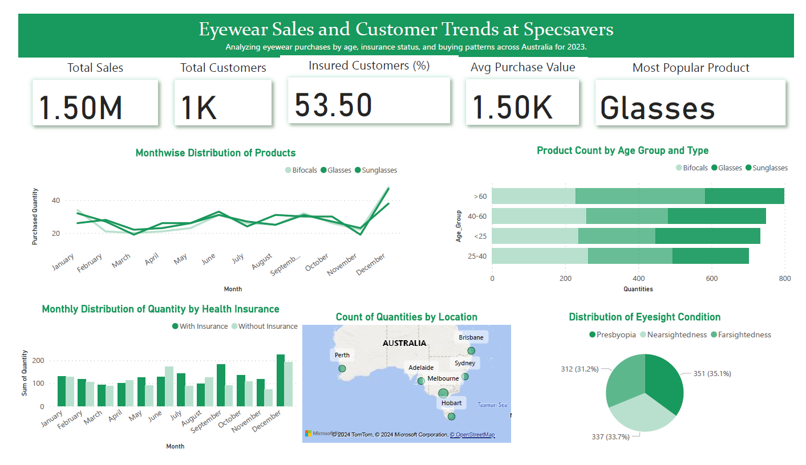

# Specsavers Data Visualization Dashboard

This repository contains a Power BI dashboard designed using mock data, showcasing key business insights for Specsavers. The dashboard focuses on data-driven decision-making, presenting key performance indicators (KPIs), trends, and visualizations to support effective business reporting.

## Files in the Repository

- **`specsavers.pbix`**: This file contains the Power BI report with the complete dashboard, including all data models, visuals, and filters.
- **`specsavers.pdf`**: A PDF version of the dashboard to provide a static view of the visualizations for easy sharing and review.

## Dashboard Overview

The Power BI dashboard highlights the following:
- **Key Performance Indicators (KPIs)**: Displays important business metrics such as Total Sales (1.50M), Total Customers (1K), Insured Customers (53.5%), and Average Purchase Value (1.50K AUD).
- **Product Trends**: Visualizes the monthly distribution of products (Bifocals, Glasses, Sunglasses) and sales trends.
- **Customer Demographics**: Presents product purchase data by age group and type, showing how different age groups prefer certain products.
- **Health Insurance Data**: Illustrates the monthly distribution of quantities by health insurance status (with and without insurance).
- **Geographical Insights**: Displays the distribution of sales by location across major cities in Australia.
- **Eye Condition Distribution**: Pie chart showing the distribution of eyesight conditions (Presbyopia, Nearsightedness, Farsightedness).

Below is a preview of the dashboard:

## Usage

1. **Power BI File**:
   - Open the `specsavers.pbix` file in Power BI Desktop to explore the full dashboard with interactive functionality.
   

## Key Insights from the Dashboard

- **Most Popular Product**: Glasses are the most popular product sold.
- **Geographical Distribution**: Melbourne and Sydney show the highest quantities of product purchases.
- **Health Insurance Trends**: A significant number of customers with health insurance purchase eyewear regularly.

Feel free to explore the Power BI file or review the attached PDF for more details!
